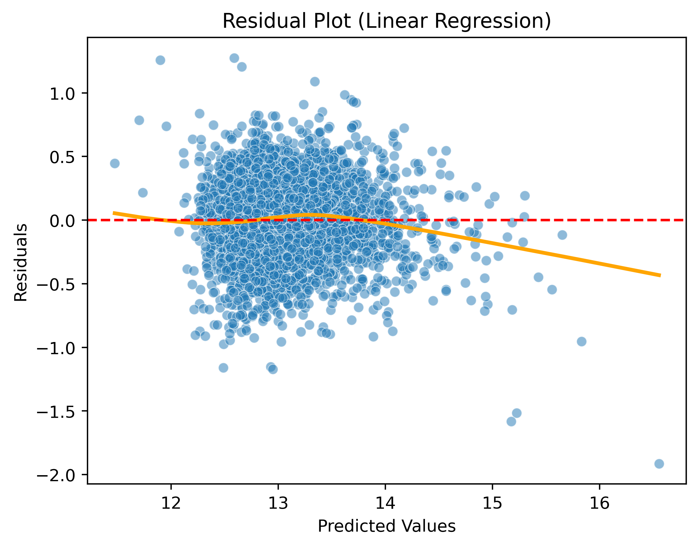
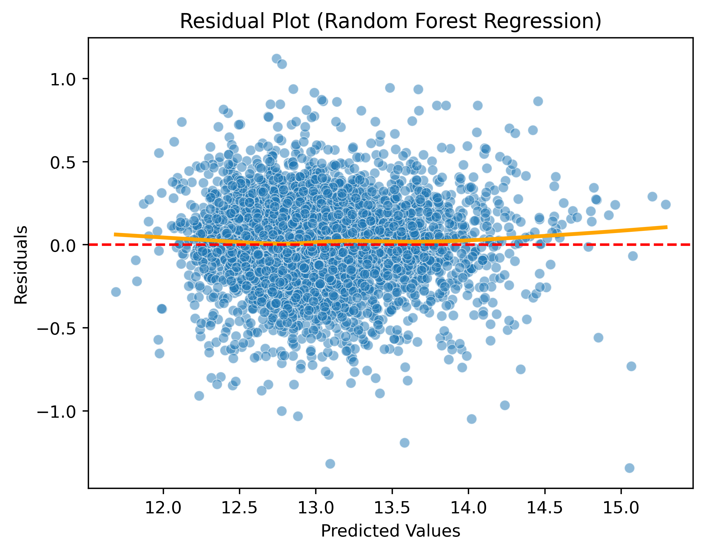
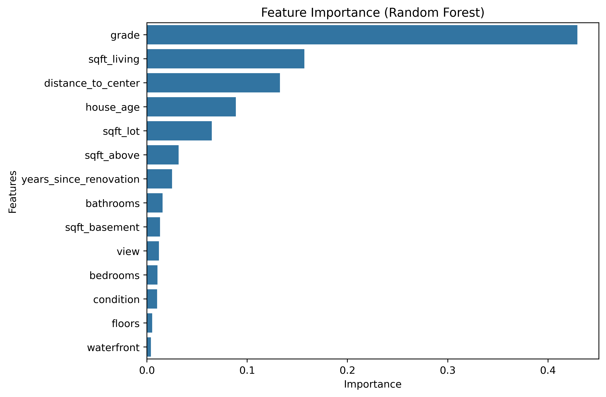

# House Price Prediction Model

## Overview
This project focuses on predicting house prices using both linear and non-linear machine learning models. The goal was not only to achieve accurate predictions but also to understand the underlying relationships within the data and evaluate model behavior in depth.

## Dataset
The dataset contains information about residential properties, including features such as living area, number of bedrooms, construction year, and renovation status. \
The target variable is the house price.

The dataset used in this project is available on Kaggle: \
-> https://www.kaggle.com/datasets/harlfoxem/housesalesprediction

## Methodology
### Approach
The analysis began with a baseline using linear regression models, including:
- Linear Regression
- Ridge
- Lasso
- ElasticNet

To improve model performance, several meaningful features were engineered, such as:
- House age (derived from construction year)
- Distance to center (derived from latitude and longitude)
- Years since renovation (accounting for renovation status)

These transformations allowed the model to better capture the current condition of properties rather than relying on raw year and location values.

### Model Evaluation
All models were evaluated using:
- R²
- MSE
- RMSE

The results showed that:
- Linear and regularized models performed very similarly
- Optimal regularization parameters were very small
- This indicates that the data does not suffer from strong overfitting and is largely linear

### Linear Regression
#### Residual Analysis
A detailed residual analysis was conducted to validate model assumptions:

- Residuals showed a systematic curved pattern
- Indicating the presence of non-linear relationships
- Extreme values were not well captured

### Random Forest Regression
#### Model Evaluation
A Random Forest Regressor was introduced to address non-linear patterns.
- MSE improved from ~0.09 → ~0.065
- This represents a moderate but meaningful improvement

Interpretation:
- The data is mostly linear, but contains non-linear components
- Random Forest captures these additional patterns

#### Residual Analysis
- Residuals were more randomly distributed
- The systematic pattern disappeared
- This confirms that the model captures non-linear structures more effectively

#### Feature Importance
Feature importance analysis (Random Forest) showed that:
- Property grade, size and location are the strongest predictors
- Engineered features contributed to improved performance
- Feature engineering played a key role in model quality

## Conclusion
Overall, the project demonstrates that:
- Linear models provide a strong and interpretable baseline
- Feature engineering significantly improves performance
- Residual analysis is crucial for diagnosing model limitations
- Non-linear models such as Random Forest can further improve predictions by capturing complex relationships

## Future Work
Potential improvements include:
- More advanced feature engineering
- Testing additional non-linear models
- Exploring interaction effects between features

For the full analysis see the notebook: \
-> [notebook/analysis_houseprices.ipynb](https://github.com/kubaamarczak/house-price-prediction-system/blob/main/notebook/analysis_houseprices.ipynb)